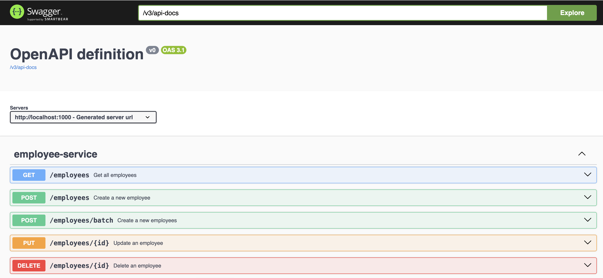
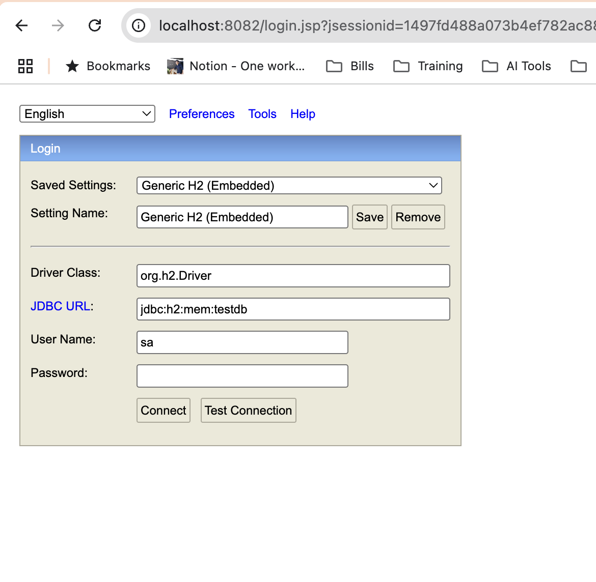

# Invex API

A reactive API built with **Java Spring Boot WebFlux**, designed for performance, scalability, and containerized deployment using Docker.

---

## 📥 1. Cloning the Repository

To get started, first clone the repository:

```bash
git clone https://github.com/jonakmex/invex.git
cd invex
```

---

## 🧪 2. Compilation & Testing with Gradle

Use the following commands to compile and test the application:

```bash
./gradlew clean build
./gradlew clean test
```

---

## 🐳 3. Docker Build, Pull, and Run

### 🔧 Build the Docker Image

```bash
docker build --platform=linux/amd64 -t jonakmex9824/invex-api:0.0.2-RELEASE .
```

### 📥 (Alternatively) Pull the Prebuilt Image

```bash
docker pull jonakmex9824/invex-api:0.0.1-RELEASE
```

### ▶️ Run the Image

```bash
docker run \
  -p 8080:1000 \
  -e SPRING_PROFILES_ACTIVE=dev \
  -e DATABASE_HOST=<your-db-host> \
  -e DATABASE_PORT=<your-db-port> \
  -e DATABASE_NAME=<your-db-name> \
  -e DATABASE_USERNAME=<your-db-username> \
  -e DATABASE_PASSWORD=<your-db-password> \
  jonakmex9824/invex-api:0.0.1-RELEASE
```

Replace placeholders with your actual PostgreSQL configuration.

---

## 🧪 4. Running Locally (Test Profile)

### Profile Configuration (`local`)

```yaml
spring:
  profiles:
    active: local

  r2dbc:
    url: r2dbc:h2:mem:///testdb
    username: sa
    password:
```

### 🌐 URLs

- Swagger Docs: [http://localhost:1000/swagger-ui.html](http://localhost:1000/swagger-ui.html)
- H2 Console: [http://localhost:8082](http://localhost:8082)

> ℹ️ Note: Port **1000** is used by Render.com when deploying. Make sure to align your configuration.

---

## 🚀 5. Running with `dev` Profile (PostgreSQL Required)

Update your `application.yaml` for the `dev` profile as follows:

```yaml
spring:
  profiles:
    active: dev

  r2dbc:
    url: r2dbc:postgresql://${database.host}:${database.port}/postgres
    username: ${database.username}
    password: ${database.password}
    pool:
      enabled: true

server:
  port: ${PORT:1000}
```

This profile requires environment variables or Docker flags to set the database connection details.

---

## 🐳 6. Running with Docker Compose (MySQL)

To run the API and MySQL together using Docker Compose, use the provided environment variables for MySQL initialization.

### Example `docker-compose.yml`

```yaml
services:
  mysql:
    image: mysql:8.0
    environment:
      MYSQL_DATABASE: invex
      MYSQL_USER: invex
      MYSQL_PASSWORD: invex123
      MYSQL_ROOT_PASSWORD: qazwsx12
    ports:
      - "3306:3306"
    healthcheck:
      test: ["CMD", "mysqladmin", "ping", "-h", "localhost"]
      interval: 10s
      timeout: 5s
      retries: 5

  invex-api:
    image: jonakmex9824/invex-api:0.0.1-RELEASE
    ports:
      - "8081:1000"
    environment:
      SPRING_PROFILES_ACTIVE: dev
      DATABASE_HOST: mysql
      DATABASE_PORT: 3306
      DATABASE_NAME: invex
      DATABASE_USERNAME: invex
      DATABASE_PASSWORD: invex123
    depends_on:
      mysql:
        condition: service_healthy
```

### How to Run

```bash
docker-compose up
```

- The API will be available at [http://localhost:8081](http://localhost:8081).
- MySQL will be initialized with the specified credentials.
- The API will wait for MySQL to be healthy before starting.

> ℹ️ Make sure Docker is installed and running on your system.

## 📸 7. Screenshots

### Swagger UI



### H2 Console


---

## 📸 8. Postman Collection
[Download Postman Collection](docs/images/REST_Employee.postman_collection.json)
## 💬 Questions or Issues?

Please open an [issue](https://github.com/jonakmex/invex/issues) or contact the maintainer.
